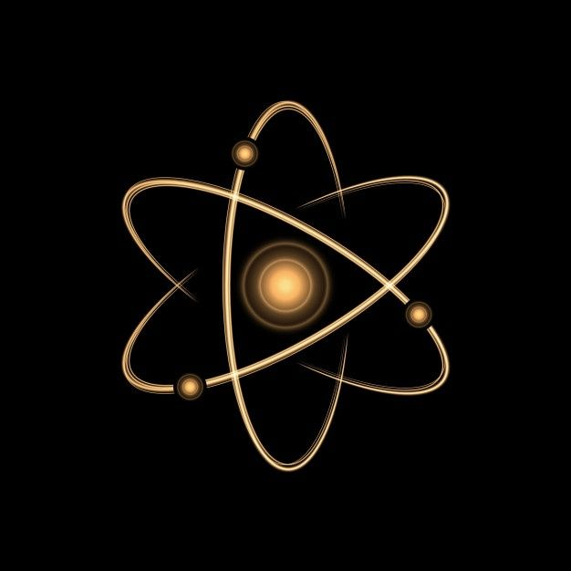

<!-- PROJECT LOGO -->
<br />
<div align="center">
  <a href="https://github.com/Pragadhesh/chemistry">
    
  </a>

  <h3 align="center">Chemistry Pack</h3>

  <p align="center">
    Chemical Elements Pack for Coda 
  </p>
</div>


<!-- ABOUT THE PROJECT -->
## About The Project

There are many great Document editors present however, I didn't find one that really suited my needs to help writing document on chemistry

Here's why:
* Your time should be focused on creating something amazing. A project that solves a problem and helps others
* You shouldn't be doing the same tasks over and over from scratch
* You should implement DRY principles to the rest of your life :smile:

<p align="right">(<a href="#top">back to top</a>)</p>


### Built With following npm modules

This section should list any major modules used to bootstrap this Pack

* @codahq/packs-sdk
* compound-parser
* node-periodic-table
* molarmass.js

<p align="right">(<a href="#top">back to top</a>)</p>


### Installation and Usage

Please refer to the following documentation from CODA to get started [https://coda.io/packs/build/latest/tutorials/get-started/cli/](https://coda.io/packs/build/latest/tutorials/get-started/cli/)

Below is an example of how you can instruct your audience on installing and setting up your app.

1. Clone this repository
    ```sh
   git clone https://github.com/Pragadhesh/chemistry.git
   ```
2. Install the npm packages
    ```sh
   npm install
   ```
3. Run it locally using npm coda execute pack.ts <function name> <arguments>
      ```sh
   npm coda execute pack.tx <functionname> <arguments>
   ```
<p align="right">(<a href="#top">back to top</a>)</p>
 
 
  
